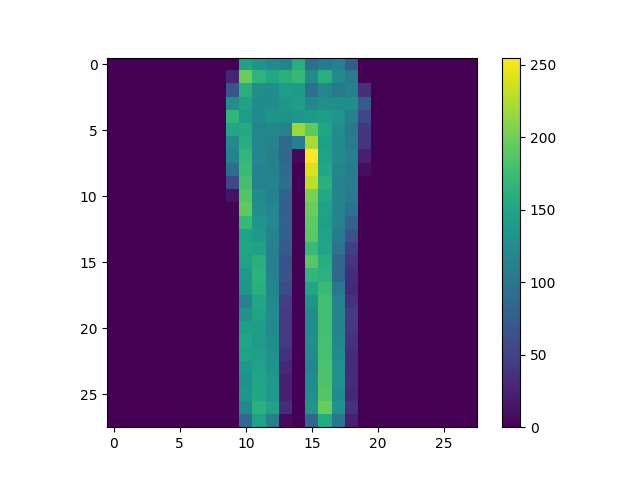
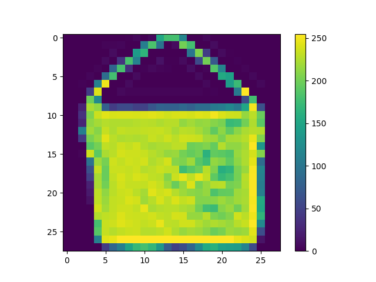
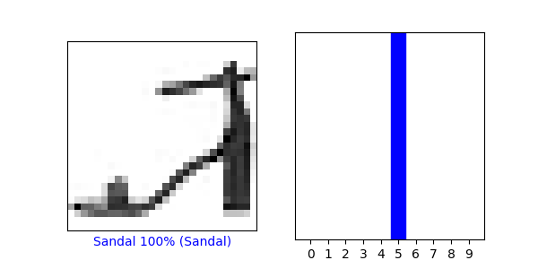
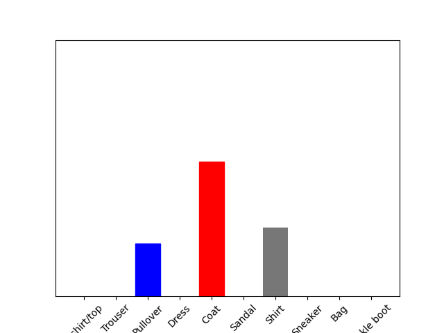
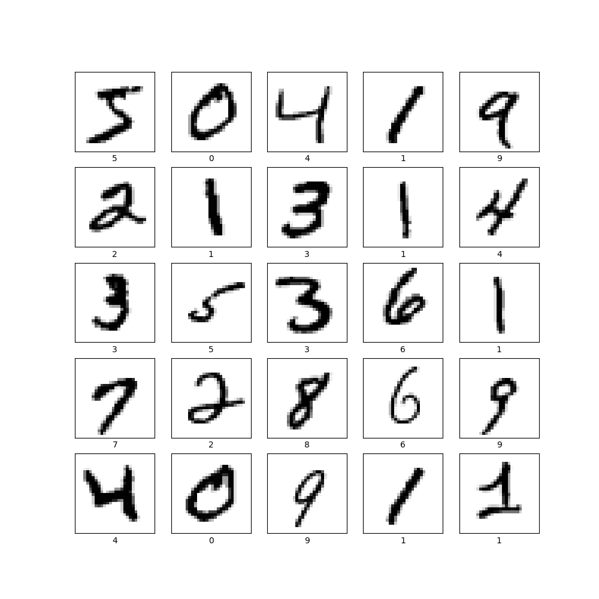
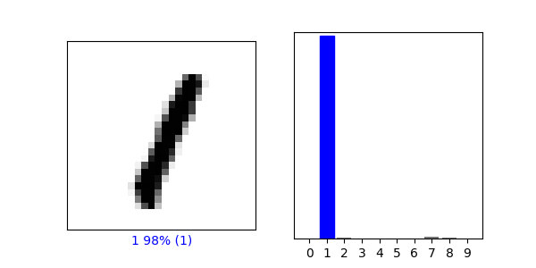
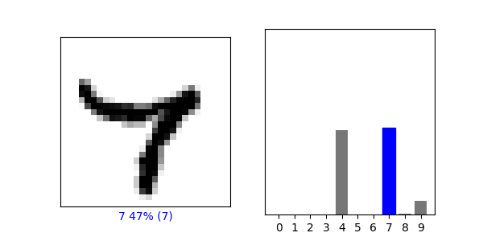

# Wednesday 7/7

### Three new training images:
   

   
### New prediction array:
##### This array shows the models probabilistic classification of the image on the left. After training the model with the training data it can predict the identity of new images. However, the vector initially generated by the model (logits) cannot be used for classification because it has not been normalized. The softmax function solves this problem by changing the values in the array so that they all add up to 1. After the vector has been normalized, the argmax function can be utilized to find the index value of the most probable class by denoting the highest value in the normalized vector as 1 and the rest as 0. In this case, the normalized array indicated that the model was 100% sure the image was a sandal and it was correct. Additionally, the softmax function enables us to tune nueral networks because (unlike argmax) it is diferentiable.
   
##### Similar to the softmax function, the sigmoid function also works by normalizing logits for classification; however, this can only be used for binary classification problems.
     
   
      
### Testing the model on a single image [57]:
##### When testing the neural net, we do not call the Softmax function again because it was baked into the model stored as probability_model. However, we call argmax again to determine which value is the highest in the Softmax-normalized array because this action is not implicit within the model. In this case, the predicted value does not match the true identity of the test image.
   
   

### Classifying hand written numbers:
##### The model classified items correctly at a rate of 95% on both the training and testing data sets. This model outperformed the first one, but only by marginally. Though I cannot say why for certain, I assume this descrepency is due to the digits having more distinct profiles than the clothing items since both datasets have identically shaped training and testing sets and each model is working with 10  classes.
     
   
   
   