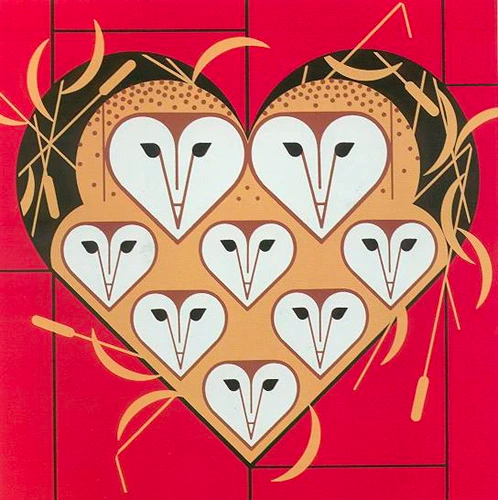
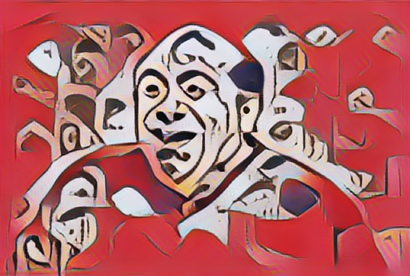
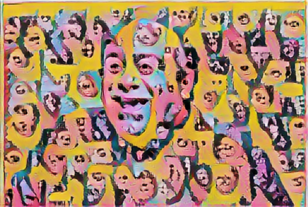
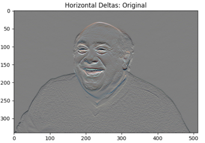
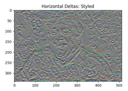
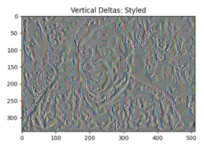
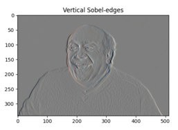
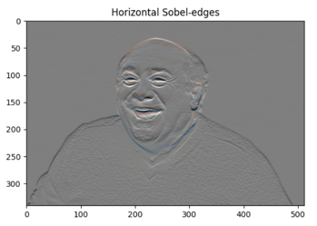
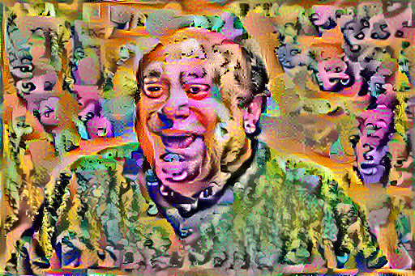

# Wednesday 7/28 - Neural Style Transfer
On wednesday, we used Tensor Flow to perform a neural style transfer, following the 4 steps I have outlined below. Using the same approach, I used a collection of new images to practice neural style transfer.

### ___Content Image:___

##### Danny DeVito

### ___Style images:___

##### Owl Prints (Charley Harper)

##### Marilyn Monroe Print (Andy Warhol)

### ___Define and extract content and style representations____
The first step for neural style transfer was to build a model to define (and later extract) features from the style images. In class, we utilized a pretrained image classification network - VGG19 - to define the images' contents. To build the extraction model, I chose which layers to use for content and style and built a model to implement said layers. After running the model, I was left with Gram matrices for the content and style images. These matrices work by calculating the outer product of the feature vector with itself at each location and allow us to represent style in a highly transposable manner.

### ___Implementing the style transfer algorithm___
To run gradient descent, I first needed to define it within a `tf.Variable` object, define a function to keep pixel values between 0 and 1, and create two weighted optimizers to calculate the model's total loss. With this in place, I defined a function using `tf.GradientTape` at a rate of 100 training steps per epoch over 10 epochs. This produced the following results:

### ___Apply regularization term on the high frequency components___

##### As demonstrated in the images below, preprocessing the original images into the stylized format creates alot of variancec in the images. In order to reduce this, I reran the model I outlined above with regularization layers encoded within it. 

### Stylized with regularization:

