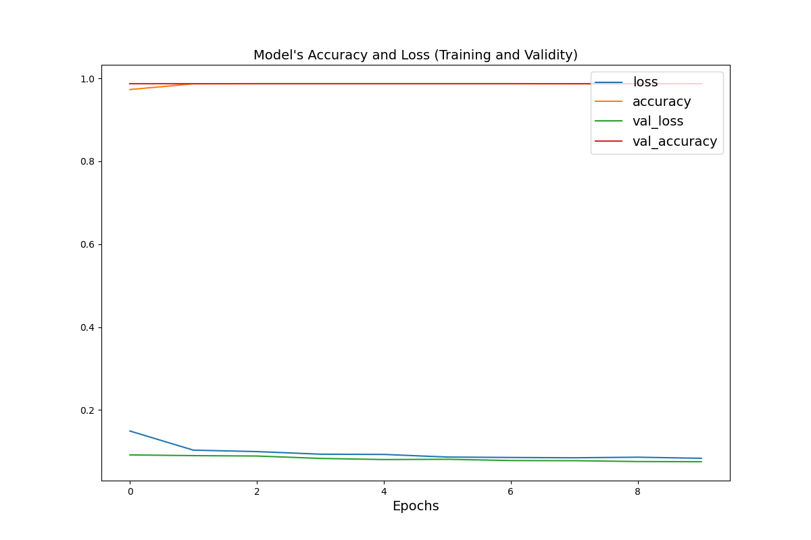

# Monday 7/12 - Liz and John

### It is clear that the multi-class DNN regression produces a better loss metric at a far more efficient rate than the multi-class linear regression.

### Multi-class linear regression loss graph:

### Multi-class DNN regression loss graph:


### Before picking new variables for the model, we generated a heatmap to see how each variable correlates with MPG.


### After testing various feature combinations, the best model we came up with was a multi-class linear model fitted to the dataset outlined below.
```
dataset = raw_dataset[[‘highway-mpg’, ‘city-mpg’, ‘peak-rpm’, ‘num-of-cylinders’, ‘engine-size’, ‘horsepower’, ‘curb-weight’, ‘body-style’, 'price']].copy(). 
```
