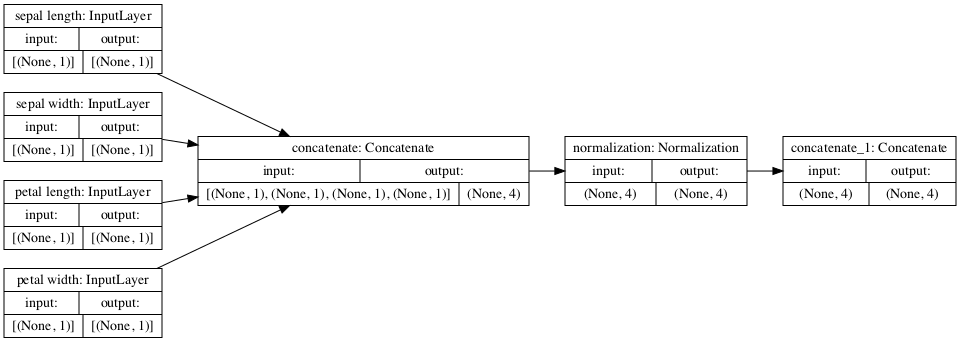
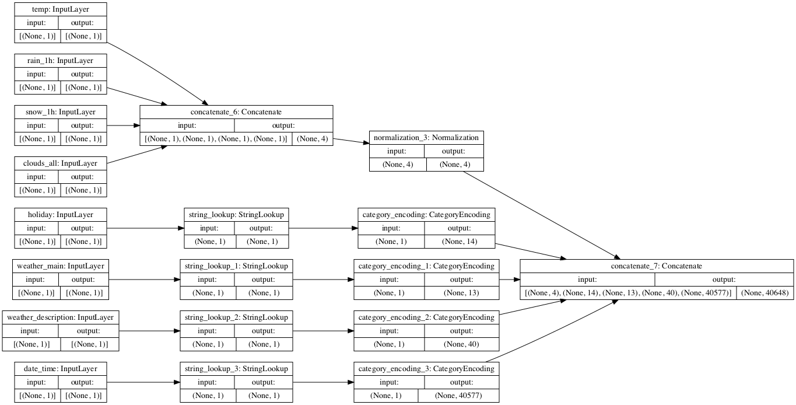
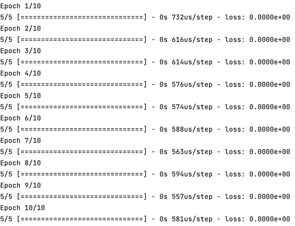
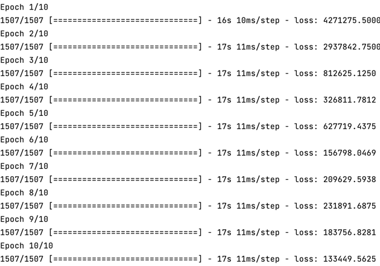

# Monday 7/19
### ___Use the `plot_model()` command from `tf.keras.utils` to produce the plot that describes the input preprocessing step.___
##### ___Iris:___
   
   ##### ___Interstate:___
   
   
   
### ___Describe the plot of each model for the two dataset preprocessing steps.  What does each box in the illustration represent?  Are there different paths towards the final concatenation step?___
##### The preprocessing for the iris dataset was quite straightforward because all of the inputs were floats. So, as shown in the plot above, there were only two steps: concatenating the layers and normalizing the values. Since there were no other dtypes present, the data was fully preprocessed after these steps.
##### Unlike the iris dataset, the interstate set's features varied in dtype. As shown in the model above, my first step was to separate the objects (strings) from the continuous variables (int and float). After this, I applied normalization to the numeric variables and category encoding (hot one) to the strings. In the end, my data was preprocessed and ready to be fed into the model for training.

### ___What is occurring at each step and why is it necessary to execute before fitting your model.___
##### Before preprocessing the data using tensor flow, I first needed to convert the labels into numbers so that they could be used to train the model. While it might have been possible to couple this step with preprocessing, I was not sure how to do that and instead opted to create a new array mapping the labels to 0, 1 or 2. After completing this task, I moved on and began preprocessing my features. Since they were all floats and in the same units, all I had to do was concatenate and normalize the 4 features.
##### As with the iris dataset, one of the primary preprocessing steps for the interstate dataset was to normalize all of the numeric values. While this process ocurred, I simultaneously preprocessed the non-numeric data using StringLookup and CategoryEncoding. This is necessary before fitting the model b/c we want each feature to hold the same weight and operate on the same axes. Without preprocessing, the model would not train well (if at all) on the data, so it is an imperative preliminary step in the model-building process.
   

### ___Train each model and produce the output (not necessary to validate or test).  Describe the model output from each of the trained metro traffic interstate dataset and the iris flowers dataset.  What is the target for each dataset?  How would you assess the accuracy of each model?  Are you using a different metric for each one?  Why is this so?  What is each one measuring?___
    
##### For the iris dataset, I chose to use Categorical Crossentropy for the loss function because the labels fall into 3 categories - Iris Setosa, Iris Versicolour or Iris Virginica - which I mapped to 0, 1 and 2. I chose this as the loss function because it most aptly evaluates the performance of a model that is making predictions for 2+ labels. In the end, my model's performance was extremely odd. For some reason, my loss values came out extremely low, leading me to believe that I made a mistake or generated an extremely overfit model.

### Unlike the iris model, the target for the interstate dataset was continuous, not categorical. So, to account for this difference, I chose Mean Squared Error to be my loss function. MSE is best for models predicting a continuous variable because it effectively represents the average of the distance between each y and y_pred squared. Like with the iris dataset, my model's performance on the interstate data was very odd. As you can see below, my loss value starts out tremendously high and, while it does lower quite a bit, ends high as well.

