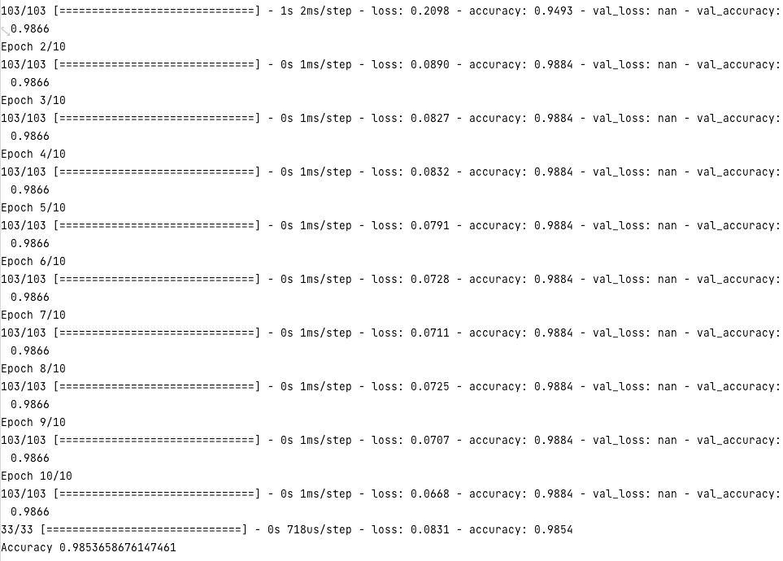
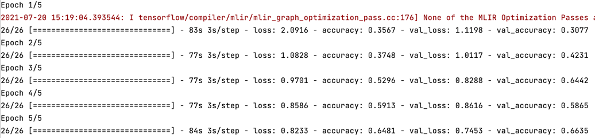

# Project 1

---
1. How did your model fare?
   * My model, built on Zillow data from Cincinnati, performed with an MSE of 28.5375. As shown in the graph below, the model's
   loss dropped dramatically after the initial epochs before stabilizing around ~5.4. Overall, the model performed fairly well. Though it struggled
     to predict the prices of the most expensive houses, it fared well in the lower price range and could be greatly improved with a 
     more expansive, less skewed, training dataset.
     * 
   
2. In your estimation is there a particular variable that may improve model performance?
   * Including year built in the training data could potentially improve the model's performance. Whereas bedrooms, bathrooms and living Area provide
   useful information, they do not necessarily indicate home quality. Year built would not totally solve this issue, but it would indicate how new
     the house is, which could act as a proxy for its general quality. For instance, a house built in the mid 80's may have a 40-year-old roof, which would drastically impact the price.
     
3. Which of the predictions were the most accurate? In which percentile do these most accurate predictions reside? Did your model trend towards over or under predicting home values?
    * The model's most accurate predictions fell in the bottom 75% of homes based on price. Using the .describe() command, I found that the 50th and 75th percentile for price
      were $156,000 and $433,725 respectively, and that the mean price was $379,809. This information tells me a number of things: First, the model was trained primarily on houses that sold for
      less that $500,000. Additionally, since the mean is so much greater than the standard deviation, the dataset appears to be skewed heavily to the right. This ties into the model's performance
      because, as shown in the graph below, it performs the best on homes that sell in the bottom 60% in terms of prices, whereas there is lower predictive accuracy for homes that
      sold for $500,000+. In line with this, I also found that the model tends to over predict the prices. This is also likely due to the rightward skew
      present in the original training data.
        
   
4. Which feature appears to be the most significant predictor?
    * Number of bedrooms appears to me the most significant feature in my model. To determine this, I split the three features into their own respective variables and created
   three new neural nets based on their contents, respectively. After testing the predictive abilities of these models, I found that
      the one built on the bedrooms' data alone performed the best with an MSE of ~18.5. The other two models - built on bathrooms and livingArea - had MSE's of
      ~ 26, so they are worse predictors.
