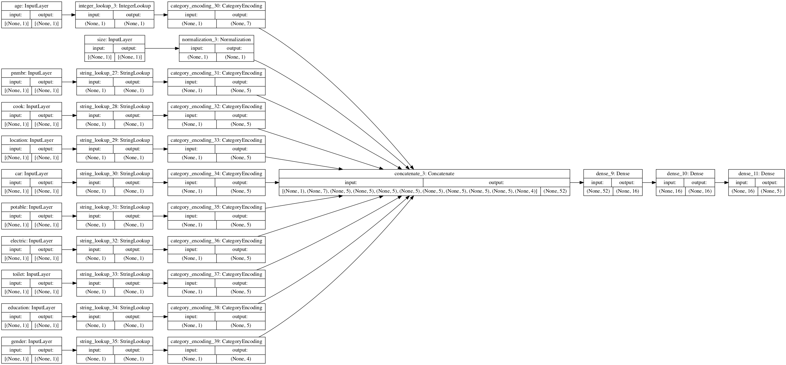
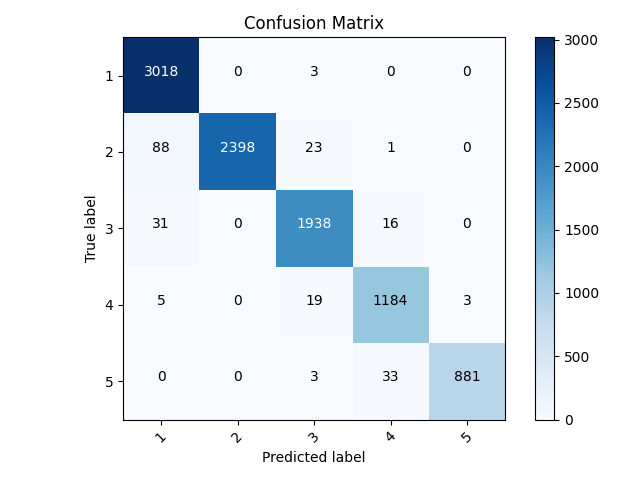

# Project 3 - 7/27
## Part 1 - Binary Classification
### For project 3, I essentially delved deeper into the model that I discussed in [thursday's informal response](thursday3.md). After loading in the data and dropping the features `weights, wealth and unit`, I created preprocessing layers as an input pipeline for the dataset. 

### Above, I have included a visualization of my model's preprocessing pipeline. For my first model's input pipeline, I decided to use three differnet types of preprocessing layer. First, I utilized a normalization layer to preprocess the `size` column. Then, utilizing `StringLookup` and `IntegerLookup`, I used categorical encoding layers to process the remaining columns before concatenating the all of the preprocessed layers, effectively ending the input pipeline.
### With my input pipeline assembled, I began training models. In total, I tested this model with 5 different targets (one for each wealth class). For the first test, I set the lowest wealth class (1) to 0 1 and the rest (2,3,4 and 5) to 0. After repeating this procedure for each wealth class, I found that the model performed worst on the lowest wealth class:


### And performed best on the highest wealth class (98.40% testing accuracy):


### After running these models and visualizing their performance with confusion matrices, I can see that they are both suffering from extreme class imbalances. In both cases, the model is predicting every example to be of class 0. Though I cannot be certain, I believe this issue will be solved in the second part because the n size for each label is much larger and more representative.
## Part 2 - Multi-Class Classification
### The second part of this process tasked me with creating a model to predict the wealth class (1-5) of each example in the `country_persons.csv` dataset. With the data in a `dataframe` object, I began doing some hard code in order to bucket `age` and `toilet`. To bucket these columns I used the following:
```
# Bucket toilet:
toilet = []
cols1 = ['Flush to pit latrine', 'Flush to piped sewer system','Flush to somewhere else','Flush to septic tank', "Flush, don't know where"]
cols2= ['Ventilated Improved Pit latrine (VIP)', 'Pit latrine without slab/open pit', 'Pit latrine with slab']
cols3 = ['No facility/bush/field','99','Hanging toilet/latrine', 'Composting toilet','Bucket toilet','Other', ]
for i in dataframe['toilet']:
  if i in cols1:
    toilet.append(0)
  elif i in cols2:
    toilet.append(1)
  elif i in cols3:
    toilet.append(2)
dataframe['toilet'] = toilet

# Bucket age:
age = []
for i in dataframe['age']:
  if i < 7: age.append(0)
  elif i in range(7,16): age.append(1)
  elif i in range(16,21): age.append(2)
  elif i in range(21,32): age.append(3)
  elif i in range(32, 60): age.append(4)
  else: age.append(5)
dataframe['age'] = age

# Bucket potable:
potable = []
cols1 = ['Protected spring', 'Piped into dwelling', 'Piped to yard/plot', 'Protected well']
cols2 = ['Unprotected spring', 'Unprotected well']
cols3 = ['Tube well or borehole', 'Public tap/standpipe']
cols4 = [ 'River/dam/lake/ponds/stream/canal/irrigation channel', 'Rainwater', 'Tanker truck', 'Cart with small tank', 'Bottled water']
cols5 = ['99']
for i in dataframe['potable']:
  if i in cols1: potable.append(0)
  elif i in cols2: potable.append(1)
  elif i in cols3: potable.append(2)
  elif i in cols4: potable.append(3)
  elif i in cols5: potable.append(4)
dataframe['potable'] = potable
```
### With these columns bucketed, I set my target variable to `dataframe['wealth']` and split the dataframe into three separate datasets for training, testing and validation. After splitting the data, I assigned a preprocessing layer for each feature column. For my only numeric column, `size`, I used a normalization layer. Then, for the categorical features, I used `StringLookup` and `IntegerLookup` to bake one hot coding in to the categorical feature columns.

###  After creating and compiling all the preprocessing layers, I fed them into the following model:
```
all_features = tf.keras.layers.concatenate(encoded_features) # combine preprocessing layers
model = tf.keras.layers.Dense(8, activation="relu")(all_features)
model = tf.keras.layers.Dense(22, activation="relu")(model)
model = tf.keras.layers.Dropout(0.35)(model)
output= tf.keras.layers.Dense(num_classes, activation="softmax")(model)
model = tf.keras.Model(all_inputs, output)
model.compile(optimizer='adam',
              loss= tf.keras.losses.SparseCategoricalCrossentropy(from_logits=True),
              metrics=["accuracy"]
```
### This model accurately predicted wealth class at a rate of 97.67% on the test data. Furthermore, as demonstrated below, the model trains to a near perfect accuracy by around 6 epochs, but does not become significantly overfit until epoch 9.


### This confusion matrix further demonstrates this model's performance:


### After looking more closely at the feature column labels, I realized that `hhid`- household id - correlates highly with class label, falsely boosting the model's performance. After I removed this feature column from the dataset, the model's behavior became much more normal. For one, the testing accuracy of the model lowered down to 57.67%, which seems much more realistic to me than what the multi-class model originally outputted.


### Furthermore, after visualizing the model's confusion matrix, I noticed that the model's bunders typically occured when classifying the lower wealth classes - for instance, the model commonly mixed up 2 and 1. Though it may seem odd, this tells me that the model is functioning properly because, as I found in part 1, it paralells what I saw happen in part 1. So, though I cannot say for certain, my combined analysese from parts 1 and 2 of this project inform me that the data is, generally, very telling as to which examples belong to the higher wealth classes; however, this is not true for the lower wealth classes. 
