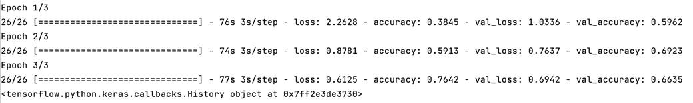
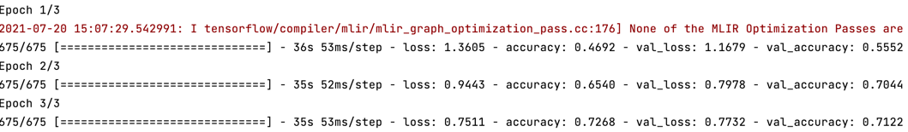
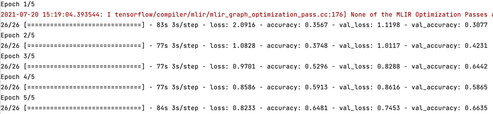
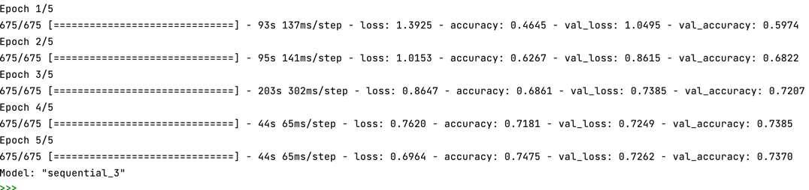

# Thursday 7/19
### ___1. Using the relevant parts from the entirety of the example script as a guide, fit a CNN model to your training data and validate using the beans dataset from Tensorflow datasets and then again train and validate using the eurosat dataset. Present your results and discuss the accuracy of each of model.___
##### After fitting the CNN model to the beans training data, I attained an accuracy of .7642 and a validation accuracy of 0.6942. Overall this model performed quite well, though it appears to be overfitting very quickly, which could be an issue with more epochs.

##### This model also performed well fitted to the eurostat dataset. After 3 epochs, it sported an accuracy and validation acccuracy of .7268 and .7122 respectively. Overall, the eurostat model's performance is superior in this instance because it remains underfit and does not show signs of overfitting after 3 epochs.

### ___2. Towards the end of this exercise is the "Apply augmentation to a dataset" example, that illustrates a resize and rescale image augmentation implementation to the tf_flowers dataset. Apply this same method to both the beans and eurosat datasets. Did your model performance improve? How many epochs were you able to run and how much time did it take? Present your results and discuss the accuracy of your augmented output.___
##### As I mentioned in (1), the beans model looked like it was going to become overfit very quickly b/c it was already doing so after 3 epochs. After augmenting this dataset, however, this issue seemed far less pressing. Before applying augmentation the dataset was performing much better on the training data than the validation, but afterwords the two scores were much closer after 10 epochs: .6481 and .6635. Additionally, contrary to (1), this model ran quickly and so I used more epochs, which demonstrated the impact augmentation can have on overfitting.

##### Unsuprisingly, the eurostat model was not deeply impacted by augmentation. Additionally, this model took much more time to run so I only used 5 epochs. After it ran to completion (still took around 20 mins), the accuracy and validation accuracy were .7475 and .7370. So, while augmentation likely improved the quality of this dataset in regards to training, the benefits were not immediately obvious to me after compiling and fitting the model.
