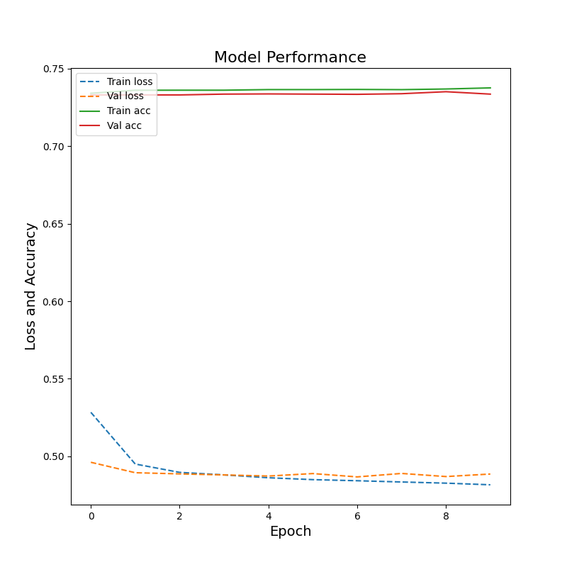
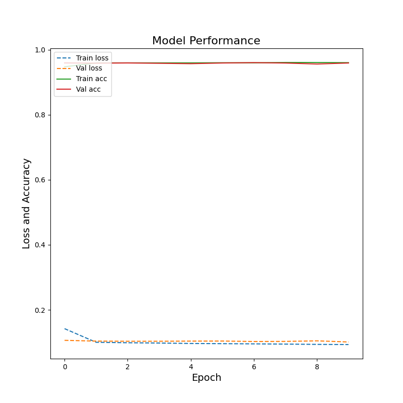

# Thursday 7/25 - John and Dylan
### Today in class, we completed the "Classify structured data using Keras Preprocessing Layers" notebook and then rearranged the code to create a predictive model on a larger dataet: `country_persons.csv`. With our first model, we aimed to predict which examples belonged to the lowest wealth class. Our model arcitecture was:
```
def baseline_model(loss):
    model = tf.keras.Sequential([
        feature_layer,
        layers.Dense(32, activation='relu'),
        layers.Dense(32, activation='relu'),
        layers.Dropout(.1),
        layers.Dense(1)])
    # Compile model
    model.compile(optimizer='adam',
        loss=loss)
    return model
loss = tf.keras.losses.CategoricalCrossentropy(from_logits=True, label_smoothing=0, name='categorical_crossentropy')
model = baseline_model(loss=loss)
```
### As for the data, we decided to exclude the feature columns `hhid, weights, wealth and unit`. Wealth clearly needed to be dropped because it correlates too highly with the target. Moving on, we found through experiemntation that the model worked better with `hhid, weights and unit` excluded. To create our input pipeline, we chose the method we preprocessing layers and designed our code very similarly to [Thursday's notebook](https://www.tensorflow.org/tutorials/structured_data/preprocessing_layers). With our pipeline in place, we subsetted the data into testing, training and validation sets, and fit the model. 
### This model performed fairly well, correctly categorizing 73% of the dataset(lowest wealth class vs the others):

### Though the model performed well on the testing data, it became overfit after 3 epochs, so the model could benefit from some regularization.

### The second model was trained to identify examples in the highest wealth class. It accurately labeled 96.06% of the test dataset:


### Even when we signifigantly lowered the learning capacity of the model, cuutting the hidden layer nodes in half, it still exhibited overfitting after 1 epoch. This behavior tells us that some feature behavior within the dataset correlate highly with the highest wealth class. Also, if we ran further models, we could change the architecture of my code to include 2 dense layers of 16 nodes each. This would likely reduce overfitting and potentially increase testing accuracy.