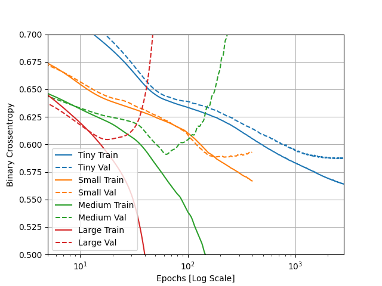
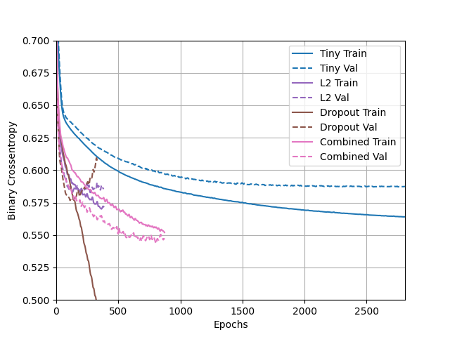
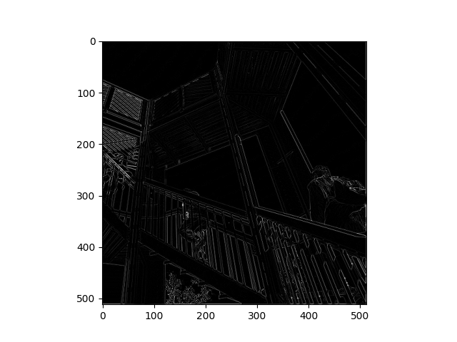
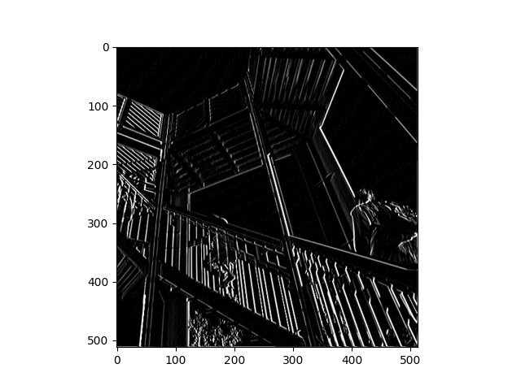
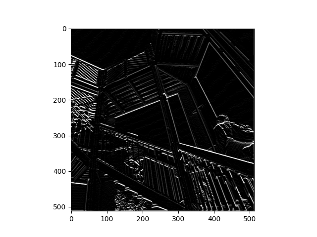
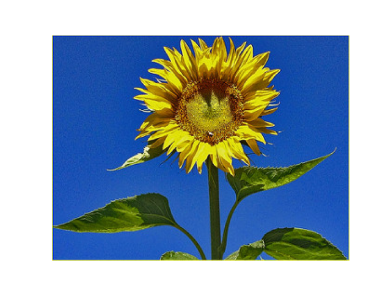
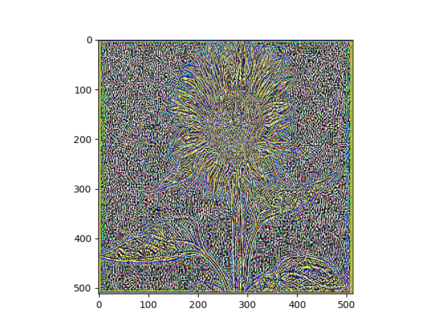
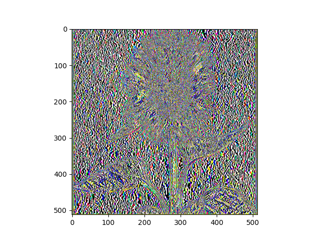
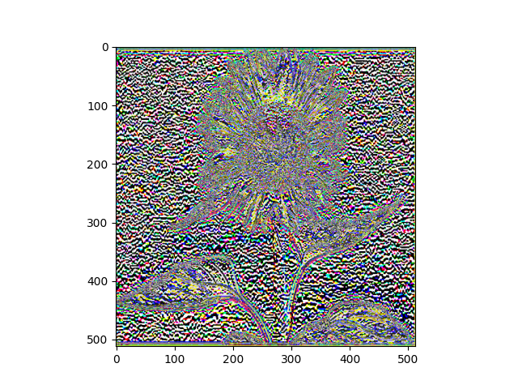
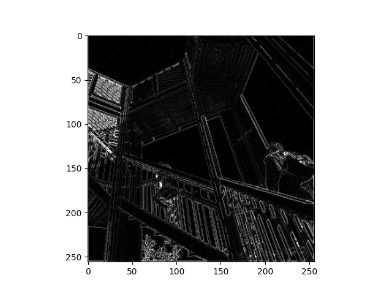

#Tuesday 7/14

## Higgs Dataset
1. ___Describe the dataset. What type of variable is the target? How many features are being used? How many observations are in the training dataset? How many are used in the validation set?___
    * The dataset contains 28 features and a class label for each of the 11 million observations.
   * The target is a nominal variable and there are 28 features for each label in the dataset.
    * The trainging and validation datasets contain 10,000 and 1000 observations, respectively.
2. ___How did each of the four models perform (tiny, small, medium and large)? Which of the four models performed the best? Which ones performed the worst? Why in your estimation did certain models perform better? Produce a plot that illustrates and compares all four models.___
    * 
    * Due to the medium and large models' superior learning capacity, they were able to minimize binary cross entropy more than the small or tiny models. However, the divergence of the medium and large models' train and validation plots means that they are quite overfit. So while the medium and large models more aptly memorized the training data, the small and tiny models provide a more realistic generalizations of the data. Overall, the tiny model performs the best because it achieves the lowest binary crossentropy while staying underfit. 
    
3. ___Apply regularization, then add a drop out layer and finally combine both regularization with a dropout layer. Produce a plot that illustrates and compares all four models. Why in your estimation did certain models perform better?___
    * 
    * Adding a dropout layer to the large model did not seem to have much impact on its overfittedness; however, L2 regularisation made the large model underfit. In the end, though, the large model performed best with L2 regularization ___and___ a dropout layer. This model (pink) is clearly uderfit and achieves a lower binary crossentropy than the tiny model, making it the best option thus far.
4. ___What is an overfit model? Why is it important to address it? What are four different ways we have addressed an overfit model thus far?___
    * An overfit model is one that performs better on the training dataset than the validation dataset. It is important that we address this issue because an overfit model does not operate on a generalized view of the data, rather it has over-memorized the training data.
    * 4 different ways to address overfitting:
        1. Increase the size of the training set
        2. Reduce the size (learning capacity) of the model
        3. Regularization (i.e. L1 and L2)
        4. Add dropout
      ---
##Convolutional Neural Networks
1. ___Modify the existing filter and if needed the associated weight in order to apply your new filters to the image 3 times.___
   1. ___```filter = [ [0, 1, 0], [1, -4, 1], [0, 1, 0]] ```: Edges___
      * 
      
   2. ___```filter = [ [-1, -2, -1], [0, 0, 0], [1, 2, 1]] ```: Horizontal Lines___
      * 
      
   3. ___```filter = [ [-1, 0, 1], [-2, 0, 2], [-1, 0, 1]]```: Vertical Lines___
      * 

2. ___Describe how each filter transformed the existing image as it convolved through the original array and reduced the object size. What are you functionally accomplishing as you apply the filter to your original array?___
   * As each filter passes over the original array, it makes calculations and produces a new array based on the filter weights. Functionally, this helps the algorithm to better learn certain features in the data and also makes it more scalable. For instance, CNN's allow us to train algorithms to identify more complex images of clothing, wheras a DNN could only identify clothes under specific circumstances (e.g. shoes must be leftward facing).The third filter's middle column is comprised entirely of zeroes, which explains why vertical lines are so prominent in this filtered image. Pixels with dark neighbors above and below will be filtered out and become zeroes, making vertical lines stand out prominently. This outcome is much more scalable and helps the algorithm learn more expansively.
   
3. ___Why is the application of a convolving filter to an image useful for computer vision?___
   * CovNets are useful for computer vision because they are able to take input images, assign importance to certain parts (pixels) of the image and use that knowledge to differentiate objects from one another. ConvNets are particularly useful b/c they can "capture spacial and temporal dependencies in an image". This attribute allows it to perform well on a dataaset of images "due to the reduction in the number of parameters involved and reusability of weights". In short, CNN's can be trained to deal with more complex images more efficiently.
   
4. ___Instead of using the misc.ascent() image from scipy, can you apply three filters and weights to your own selected image? Describe your results.___
   1. Original image:
      * 
   2. ___```filter = [ [0, 1, 0], [1, -4, 1], [0, 1, 0]] ```: Edges___
      * 
   3. ___```filter = [ [-1, -2, -1], [0, 0, 0], [1, 2, 1]] ```: Horizontal Lines___
      * 
   4. ___```filter = [ [-1, 0, 1], [-2, 0, 2], [-1, 0, 1]]```: Vertical Lines___
      * 
   
5. ___Apply a 2x2 filter to one of your convolved images, and plot the result.___
   * 

6. ___In effect what have you accomplished by applying this filter? Does there seem to be a logic (i.e. maximizing, averaging or minimizing values?) associated with the pooling filter provided in the example exercise (convolutions & pooling)? Did the resulting image increase in size or decrease?___
   * Pooling this data with the 2x2 filter reduces the overall information held within the array while, theoretically, keeping the most important parts. In this case, we take the maximum value from each 2x2 frame. This technique enhances this image's clarity by removing "noise" and decreases the overall pizel size by 1/2 (256x256).

