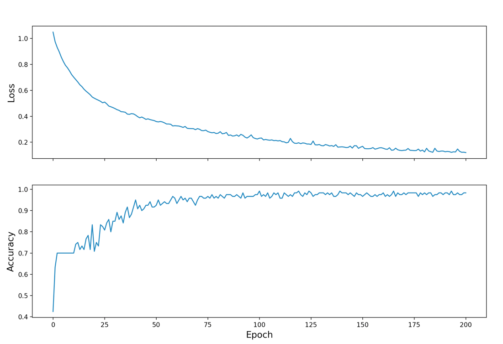
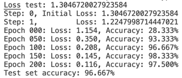
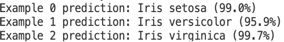

# Tuesday 7/20

#### The data being used in the model contains 120 examples, each accompanied by 4 features – sepal length, sepal width, pedal length and pedal length, and one of three labels: setosa, versicolor, or virginica. To create the `tf.data.Dataset` , my first step was to call `tf.data.experimental.make_csv_dataset` on the file path linked to the iris training data. With this function call, I created a `Dataset ` object containing the features and labels.  I further preprocessed the training dataset using `.map()` to convert features into a single array.
#### With my data ready for training, I began piecing together my model. Following the notebook, I defined my loss and gradient functions, created an optimizer, and ran the model through a training loop. To define the loss function, I used `tf.keras.losses.Sparse CategoricalCrossentropy`, which averages the loss between the model’s probability assignments and the actual class labels. Moving on, I used `tf.GradientTape` to define the gradient function and ‘tf.keras.optimizers.SGD’ to set my optimizing algorithm. Stochastic gradient descent is an algorithm that utilizes randomness to iterate over the slope of a function (‘gradient descent’) and alter nodes’ weights until it finds the lowest point on the slope.
#### Plot of the model's loss and accuracy throughout training:

#### The final step of this assignment was to analyze the model’s performance predicting the label of examples in the test dataset.  To do this, I passed the features of the test dataset through my saved model to produce an array of logits – the model’s probability assignments. To convert these into normal probabilities, I called `tf.argmax()`. Then, finally, I compared the model’s performance to the actual labels and found that the model performed well, achieving a loss of 0.116 after 200 epochs. Furthermore, the model demonstrated accuracies of 97.5% and 96.7% on the training and testing sets, respectively, making it slightly overfit. Taking it one step further, I fed the model three more examples to demonstrate its probabilistic classification. The results training and the testing I just outlined are pictured below.
#### Training results:

#### Predictions:
