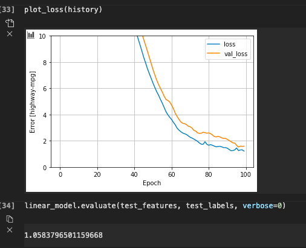
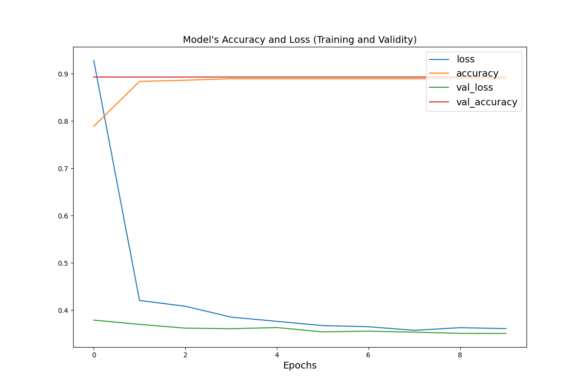
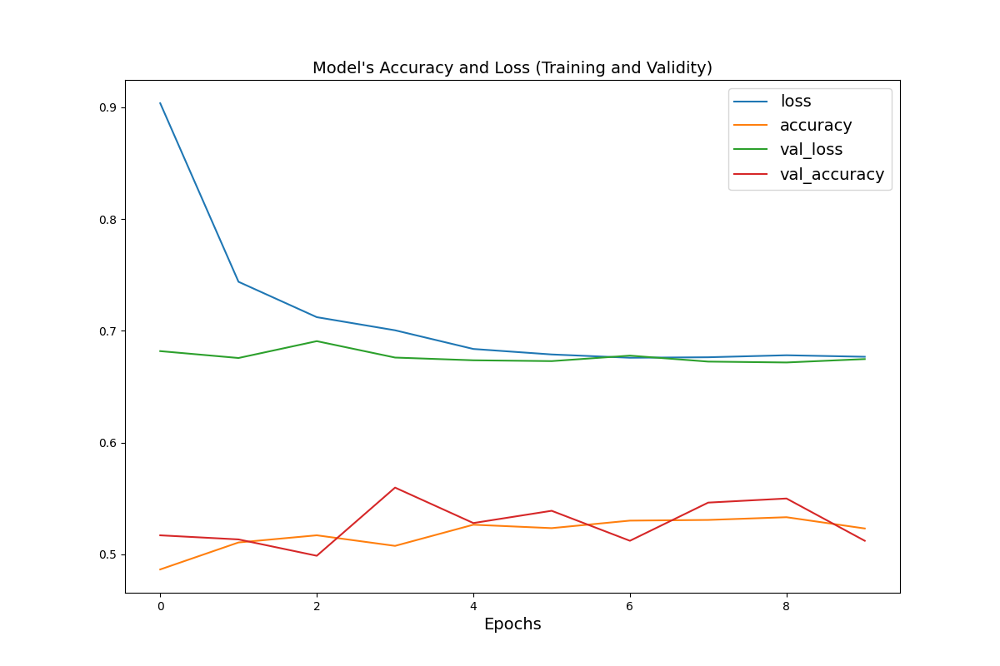

# Wednesday 7/21

### Import the dataset city_persons.csv to your PyCharm environment
```
path = '/Users/johnwillis/Desktop/PycharmProjects/data310/m3/data/city_persons.csv'
dataframe = pd.read_csv(path)
```
   

### Initially, we aimed to predict who was in the least wealthy class, 2 , so we all other wealth class labels (3,4 & 5) to 0
```
dataframe['target'] = np.where(dataframe['wealthC']==2, 1, 0) # set 2 to 1 and all else to 0
```

### Train, validate and test your model
After removing rows with missing values and remapping the 
columns 'edu' and 'gender' to be int64, we converted the dataframe 
to a `tf.data.Dataset` object by calling `from_tensor_slices`. Then, prior to
training, we used 'edu' and 'gender' to create indicator columns and 'size' and 'age' to make numeric columns.
With our training columns ready, we made and compiled our model and fit it to the training set.
```
model = tf.keras.Sequential([
    feature_layer,
    layers.Dense(32, activation='relu'),
    layers.Dense(32, activation='relu'),
    layers.Dropout(.1),
    layers.Dense(1)
])

size_histories = model.compile(optimizer='adam',
              loss=tf.keras.losses.BinaryCrossentropy(from_logits=True),
              metrics=['accuracy'])

history = model.fit(train_ds,
          validation_data=val_ds,
          epochs=10)
```

### Interpret and analyze your results. Did the model performance exhibit a particular trend
##### `dataframe['target'] = np.where(dataframe['wealthC']==2, 1, 0)`

When we first ran the model, the val_loss kept coming back as nan. Though we are still unsure why this occurred, we theorized that it could be due to severe overfitting. This would make sense for this binary classification problem because there are only 64 examples labeled with a 2. Because this sample size is so dwarfed by the other three categories, the model is easily able to tell which ones are labeled 2 and it is able to do so extremely accurately on both validation and testing sets.
    
##### `dataframe['target'] = np.where(dataframe['wealthC']==3, 1, 0)`:

This model's behavior is similar to the first. Because there are so few examples labeled '4', the model quickly reaches a high accuracy and low loss, seeming to be on a path toward overfitting.

##### `dataframe['target'] = np.where(dataframe['wealthC']==4, 1, 0)`:

Unlike the first two models, this one was working with a more balanced set of labels and trained for longer (3 epochs) before it became overfit. In the end, this model identified `dataframe['wealthC']==4` ~63% of the time on all three sets.

##### `dataframe['target'] = np.where(dataframe['wealthC']==5, 1, 0)`:

The final model we ran aimed to identify the most wealthy individuals within the dataset. After training and evaluating the model, it appeared to become overfit at around 4 epochs, reaching training and validation accuracies of 52% and 56% respectively. These results also reinforce our previous theory that the first two batches of labels simply did not contain enough examples and, thus, the models became drastically overfit and demonstrated hyperbolic results.